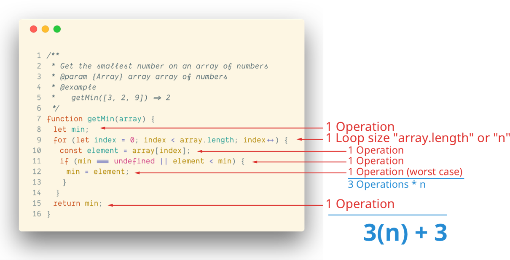
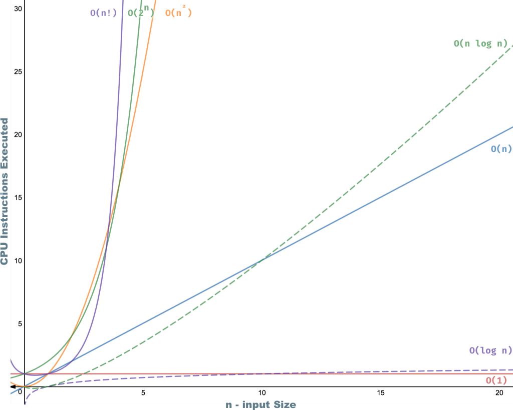
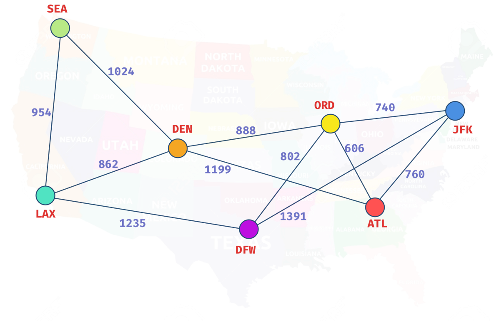
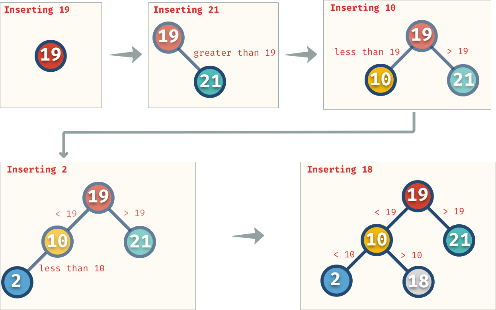

# Data Structures and Algorithms in JavaScript

[](https://circleci.com/gh/amejiarosario/dsa.js-data-structures-and-algorithms-in-javascript) [](https://badge.fury.io/js/dsa.js) [](https://dsajs-slackin.herokuapp.com)

> This is the coding implementations of the [DSA.js book](https://books.adrianmejia.com/dsajs-data-structures-algorithms-javascript/) and the repo for the NPM package.

> In this repository, you can find the implementation of algorithms and data structures in JavaScript.  This material can be used as a reference manual for developers, or you can refresh specific topics before an interview. Also, you can find ideas to solve problems more efficiently.

<!-- (Check out the Time Complexity Cheatsheet) -->


<!--
[](https://circleci.com/gh/amejiarosario/dsa.js-data-structures-and-algorithms-in-javascript)
[](https://github.com/airbnb/javascript)
[](http://makeapullrequest.com)
[](https://www.producthunt.com/posts/dsa-js)
https://bundlephobia.com/result?p=dsa.js
https://img.shields.io/bundlephobia/min/dsa.js.svg - 16.7kB
https://img.shields.io/github/repo-size/amejiarosario/dsa.js.svg - 98.1 MB
-->


<!-- [](https://embed.kumu.io/85f1a4de5fb8430a10a1bf9c5118e015) -->


## Table of Contents

<!-- START doctoc generated TOC please keep comment here to allow auto update -->
<!-- DON'T EDIT THIS SECTION, INSTEAD RE-RUN doctoc TO UPDATE -->


- [Installation](#installation)
- [Features](#features)
- [What's Inside](#whats-inside)
  - [📈 Algorithms Analysis](#-algorithms-analysis)
  - [🥞 Linear Data Structures](#-linear-data-structures)
  - [🌲 Non-Linear Data Structures](#-non-linear-data-structures)
  - [⚒ Algorithms Techniques](#%E2%9A%92-algorithms-techniques)
- [Book](#book)
- [FAQ](#faq)
- [Support](#support)
- [License](#license)


<!-- END doctoc generated TOC please keep comment here to allow auto update -->


## Installation

You can clone the repo or install the code from NPM:

```sh
npm install dsa.js
```

and then you can import it into your programs or CLI

```js
const { LinkedList, Queue, Stack } = require('dsa.js');
```

For a full list of all the exposed data structures and algorithms [see](src/index.js).


## Features

Algorithms are an essential toolbox for every programmer.

You usually need algorithms when you have to sort data, search for a value, transform data, scale your code to many users, to name a few.
Algorithms are just the step you follow to solve a problem while data structures are where you store the data for later manipulation. Both combined create programs.

> Algorithms + Data Structures = Programs.

Most programming languages and libraries indeed provide implementations for basic data structures and algorithms.
However, to make use of data structures properly, you have to know the tradeoffs so you can choose the best tool for the job.

This material is going to teach you to:

- 🛠 Apply strategies to tackle algorithm questions. Never to get stuck again. Ace those interviews!
- ✂️ Construct efficient algorithms. Learn how to break down problems in manageable pieces.
- 🧠 Improve your problem-solving skills and become a stronger developer by understanding fundamental computer science concepts.
- 🤓 Cover essential topics, such as big O time, data structures, and must-know algorithms. Implement 10+ data structures from scratch.

## What's Inside

All the code and explanations are available on this repo. You can dig through the links and code examples from the ([src folder](src)). However, the inline code examples are not expanded (because of Github's asciidoc limitations), but you can follow the path and see the implementation.

_Note: If you prefer to consume the information more linearly then the [book format](https://books.adrianmejia.com/dsajs-data-structures-algorithms-javascript/) would be more appropriate for you._

The topics are divided into four main categories as you can see below:

_(You can click on the triangle ⯈ to expand the topics)_

### 📈 [Algorithms Analysis](book/part01-algorithms-analysis.asc)

<!-- - Computer Science nuggets without all the mumbo-jumbo.
- Learn how to compare algorithms using Big O notation.
- 8 examples to explain with code how to calculate time complexity. -->

<blockquote>

<details>
  <summary>
    Computer Science nuggets without all the mumbo-jumbo
  </summary>

---

### [Computer Science nuggets without all the mumbo-jumbo](book/content/part01/algorithms-analysis.asc)

#### Learn to calculate run time from code examples



---

</details>

<details>
  <summary>
    Learn how to compare algorithms using Big O notation.
  </summary>

---

### [Learn how to compare algorithms using Big O notation.](book/content/part01/big-o-examples.asc#finding-if-an-array-is-empty)

#### Comparing algorithms using Big O notation

Let's say you want to find the duplicates on an array.
Using Big O notation, we can compare different implementations that do the same but
they take different time to complete.

- [Optimal solution using a map](book/content/part01/big-o-examples.asc#linear-example)
- [Finding duplicates in an array (naïve approach)](book/content/part01/big-o-examples.asc#quadratic-example)

---

</details>

<details>
  <summary>
    8 examples to explain with code how to calculate time complexity
  </summary>

---

[8 examples to explain with code how to calculate time complexity](book/content/part01/big-o-examples.asc#summary)

#### Most common time complexities

[](book/content/part01/big-o-examples.asc#summary)

<!-- - Constant time: _O(1)_
- Logarithmic time: _O(log n)_
- Linear time: _O(n)_
- Linearithmic time: _O(n log n)_
- Quadratic time: _O(n^2^)_
- Cubic time: _O(n^3^)_
- Exponential time: _O(2^n^)_
- Factorial time: _O(n!)_ -->

#### Time complexity graph



---

</details>
</blockquote>

### 🥞 [Linear Data Structures](book/part02-linear-data-structures.asc)

<!-- - Understand the ins and outs of the most common data structures.
- When to use an Array or Linked List. Know the tradeoffs.
- Build a Stack and a Queue from scratch. -->

<blockquote>

  <details>
    <summary>
      Understand the ins and outs of the most common data structures.
    </summary>

---

#### [Understand the ins and outs of the most common data structures](book/part02-linear-data-structures.asc)


- [Arrays](book/content/part02/array.asc): Built-in in most languages so not implemented here. [Array Time complexity](book/content/part02/array.asc#array-complexity)
    <!-- [Post](https://adrianmejia.com/blog/2018/04/28/data-structures-time-complexity-for-beginners-arrays-hashmaps-linked-lists-stacks-queues-tutorial/#Array). -->

- [Linked List](book/content/part02/linked-list.asc): each data node has a link to the next (and
    previous).
    [Code](src/data-structures/linked-lists/linked-list.js)
    |
    [Linked List Time Complexity](book/content/part02/linked-list.asc#linked-list-complexity-vs-array-complexity)
    <!-- [Post](https://adrianmejia.com/blog/2018/04/28/data-structures-time-complexity-for-beginners-arrays-hashmaps-linked-lists-stacks-queues-tutorial/#Linked-Lists) -->

- [Queue](book/content/part02/queue.asc): data flows in a "first-in, first-out" (FIFO) manner.
    [Code](src/data-structures/queues/queue.js)
    |
    [Queue Time Complexity](book/content/part02/queue.asc#queue-complexity)
    <!-- [Post](https://adrianmejia.com/blog/2018/04/28/data-structures-time-complexity-for-beginners-arrays-hashmaps-linked-lists-stacks-queues-tutorial/#Queues) -->

- [Stack](book/content/part02/stack.asc): data flows in a "last-in, first-out" (LIFO) manner.
    [Code](src/data-structures/stacks/stack.js)
    |
    [Stack Time Complexity](book/content/part02/stack.asc#stack-complexity)
    <!-- [Post](https://adrianmejia.com/blog/2018/04/28/data-structures-time-complexity-for-beginners-arrays-hashmaps-linked-lists-stacks-queues-tutorial/#Stacks) -->

---

  </details>
  <details>
    <summary>
      When to use an Array or Linked List. Know the tradeoffs.
    </summary>

---

#### [When to use an Array or Linked List. Know the tradeoffs](book/content/part02/array-vs-list-vs-queue-vs-stack.asc)

Use Arrays when…
- You need to access data in random order fast (using an index).
- Your data is multi-dimensional (e.g., matrix, tensor).

Use Linked Lists when:
- You will access your data sequentially.
- You want to save memory and only allocate memory as you need it.
- You want constant time to remove/add from extremes of the list.

---

  </details>
  <details>
    <summary>
      Build a List, Stack, and a Queue.
    </summary>

  ---

  #### [Build a List, Stack and a Queue from scratch](book/part02-linear-data-structures.asc)

  Build any of these data structures from scratch:
  - [Linked List](src/data-structures/linked-lists/linked-list.js)
  - [Stack](src/data-structures/stacks/stack.js)
  - [Queue](src/data-structures/queues/queue.js)

  ---

  </details>
</blockquote>

### 🌲 [Non-Linear Data Structures](book/part03-graph-data-structures.asc)
<!-- - Understand one of the most versatile data structure of all: Maps -->
<!-- - Know the properties of Graphs and Trees. -->
<!-- - Implement a binary search tree for fast lookups. -->

<blockquote>
  <details>
    <summary>
      Understand one of the most versatile data structure of all: Maps
    </summary>

---

#### [HashMaps](book/content/part03/map.asc)

Learn how to implement different types of Maps such as:
- [HashMap](book/content/part03/hashmap.asc)
- [TreeMap](book/content/part03/treemap.asc)

Also, [learn the difference between the different Maps implementations](book/content/part03/time-complexity-graph-data-structures.asc):

- `HashMap` is more time-efficient. A `TreeMap` is more space-efficient.
- `TreeMap` search complexity is *O(log n)*, while an optimized `HashMap` is *O(1)* on average.
- `HashMap`’s keys are in insertion order (or random depending on the implementation). `TreeMap`’s keys are always sorted.
- `TreeMap` offers some statistical data for free such as: get minimum, get maximum, median, find ranges of keys. `HashMap` doesn’t.
- `TreeMap` has a guarantee always an *O(log n)*, while `HashMap`s has an amortized time of *O(1)* but in the rare case of a rehash, it would take an *O(n)*.

---

  </details>

  <details>
    <summary>
    Know the properties of Graphs and Trees.
    </summary>

---

#### [Know the properties of Graphs and Trees](book/part03-graph-data-structures.asc)

##### [Graphs](book/content/part03/graph.asc)

Know all the graphs properties with many images and illustrations.



 **Graphs**: data **nodes** that can have a connection or **edge** to
    zero or more adjacent nodes. Unlike trees, nodes can have multiple
    parents, loops.
    [Code](src/data-structures/graphs/graph.js)
    |
    [Graph Time Complexity](book/content/part03/graph.asc#graph-complexity)

#### [Trees](book/content/part03/tree-intro.asc)

Learn all the different kinds of trees and their properties.


- **Trees**: data nodes has zero or more adjacent nodes a.k.a.
    children. Each node can only have one parent node otherwise is a
    graph not a tree.
    [Code](src/data-structures/trees)
    |
    [Docs](book/content/part03/tree-intro.asc)
    <!-- [Post](https://adrianmejia.com/blog/2018/06/11/data-structures-for-beginners-trees-binary-search-tree-tutorial/) -->

    - **Binary Trees**: same as a tree but only can have two children at
        most.
        [Code](src/data-structures/trees)
        |
        [Docs](book/content/part03/tree-intro.asc#binary-tree)
        <!-- [Post](https://adrianmejia.com/blog/2018/06/11/data-structures-for-beginners-trees-binary-search-tree-tutorial/#Binary-Trees) -->

    - **Binary Search Trees** (BST): same as a binary tree, but the
        nodes value keep this order `left < parent < right`.
        [Code](src/data-structures/trees/binary-search-tree.js)
        |
        [BST Time complexity](book/content/part03/binary-search-tree.asc#tree-complexity)
        <!-- [Post](https://adrianmejia.com/blog/2018/06/11/data-structures-for-beginners-trees-binary-search-tree-tutorial/#Binary-Search-Tree-BST) -->

    - **AVL Trees**: Self-balanced BST to maximize lookup time.
        [Code](src/data-structures/trees/avl-tree.js)
        |
        [AVL Tree docs](book/C-AVL-tree.asc)
        |
        [Self-balancing & tree rotations docs](book/B-self-balancing-binary-search-trees.asc)
        <!-- [Post](https://adrianmejia.com/blog/2018/07/16/self-balanced-binary-search-trees-with-avl-tree-data-structure-for-beginners/) -->

    - **Red-Black Trees**: Self-balanced BST looser than AVL to
        maximize insertion speed.
        [Code](src/data-structures/trees/red-black-tree.js)

---

  </details>

  <details>
    <summary>
      Implement a binary search tree for fast lookups.
    </summary>

---

#### [Implement a binary search tree for fast lookups](book/content/part03/binary-search-tree.asc)

- Learn how to add/remove/update values in a tree:


- [How to make a tree balanced?](book/B-self-balancing-binary-search-trees.asc)

From unbalanced BST to balanced BST
```
1                           2
  \                       /   \
   2        =>           1     3
    \
     3
```


---

  </details>
</blockquote>

### ⚒ [Algorithmic Toolbox](book/part04-algorithmic-toolbox.asc)

<!-- - Never get stuck solving a problem with 7 simple steps. -->
<!-- - Master the most popular sorting algorithms (merge sort, quicksort, insertion sort, etc.) -->
<!-- - Learn different approaches to solve problems such as divide and conquer, dynamic programming, greedy algorithms, and backtracking. -->

<blockquote>
  <details>
    <summary>
      Never get stuck solving a problem with 7 simple steps
    </summary>

---

#### [Never get stuck solving a problem with 7 simple steps](book/part04-algorithmic-toolbox.asc)

1. Understand the problem
1. Build a simple example (no edge cases yet)
1. Brainstorm solutions (greedy algorithm, Divide and Conquer, Backtracking, brute force)
1. Test your answer on the simple example (mentally)
1. Optimize the solution
1. Write Code, yes, now you can code.
1. Test your written code

Full details [here](book/part04-algorithmic-toolbox.asc)

---

  </details>
  <details>
    <summary>
      Master the most popular sorting algorithms (merge sort, quicksort, insertion sort, etc.)
    </summary>

---

#### [Master the most popular sorting algorithms](book/content/part04/sorting-algorithms.asc)

We are going to explore three essential sorting algorithms O(n^2), which have low overhead:
  - Bubble Sort.
    [Code](src/algorithms/sorting/bubble-sort.js)
    |
    [Docs](book/content/part04/bubble-sort.asc)

  - Insertion Sort.
    [Code](src/algorithms/sorting/insertion-sort.js)
    |
    [Docs](book/content/part04/insertion-sort.asc)

  - Selection Sort.
    [Code](src/algorithms/sorting/selection-sort.js)
    |
    [Docs](book/content/part04/selection-sort.asc)

and then discuss efficient sorting algorithms O(n log n) such as:
  - Merge Sort.
    [Code](src/algorithms/sorting/merge-sort.js)
    |
    [Docs](book/content/part04/merge-sort.asc)

  - Quicksort.
    [Code](src/algorithms/sorting/quick-sort.js)
    |
    [Docs](book/content/part04/quick-sort.asc)

---

  </details>
  <details>
    <summary>
      Learn different approaches to solve problems such as divide and conquer, dynamic programming, greedy algorithms, and backtracking.
    </summary>

---

#### [Learn different approaches to solve algorithmic problems](book/part04-algorithmic-toolbox.asc)

We are going to discuss the following techniques for solving algorithms problems:
- [Greedy Algorithms](book/content/part04/greedy-algorithms.asc): makes greedy choices using heuristics to find the best solution without looking back.
- [Dynamic Programming](book/content/part04/dynamic-programming.asc): a technique for speeding up recursive algorithms when there are many _overlapping subproblems_. It uses _memoization_ to avoid duplicating work.
- [Divide and Conquer](book/content/part04/divide-and-conquer.asc): _divide_ problems into smaller pieces, _conquer_ each subproblem and then _join_ the results.
- [Backtracking](book/content/part04/backtracking.asc): search _all (or some)_ possible paths. However, it stops and _go back_ as soon as notice the current solution is not working.
- _Brute Force_: generate all possible solutions and tries all of them. (Use it as a last resort or as the starting point).

---

  </details>
</blockquote>

## FAQ

<details>
    <summary>How would I apply these to my day-to-day work?</summary>
    <p>
    As a programmer, we have to solve problems every day. If you want to solve problems well, then it's good to know about a broad range of solutions. A lot of times, it's more efficient to learn existing resources than stumble upon the answer yourself. The more tools and practice you have, the better. This book helps you understand the tradeoffs among data structures and reason about algorithms performance.
    </p>
</details>

<details>
    <summary>Why you created this repo/book?</summary>
    <p>
        There are not many books about Algorithms in JavaScript. This material fills the gap.
        Also, it's good practice :)
    </p>
</details>

<details>
    <summary>Is there anyone I can contact if I have questions about something in particular?
    </summary>
    <p>
    Yes, open an issue or ask questions on the [slack channel](https://dsajs-slackin.herokuapp.com).
    </p>
</details>

## Book

This project is also available in a [book](https://books.adrianmejia.com/dsajs-data-structures-algorithms-javascript/). You will get a nicely formatted PDF with 180+ pages + ePub and Mobi version.

[](https://books.adrianmejia.com/dsajs-data-structures-algorithms-javascript/)

## Support

Reach out to me at one of the following places!

- Twitter at <a href="http://twitter.com/amejiarosario" target="_blank">`@amejiarosario`</a>
- Chat on <a href="https://dsajs-slackin.herokuapp.com" target="_blank">`dsajs.slack.com`</a>

## License

[](LICENSE)


